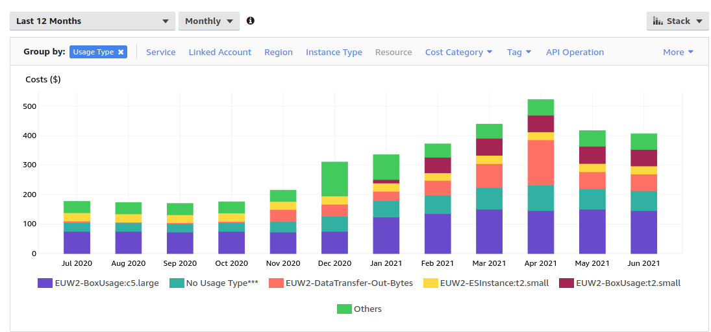

# aws-usage
Description of AWS usage for the practable ecosystem 2020-2021

## Background 

The practable ecosystem is currently hosted on AWS. This is currently paid for via an academic's personal credit card, at commercial rates, with no access to university discounts, and the slight hassle of having to prepare expense submissions. This is partly because there is no existing mechanism in School of Engineering financial system to pay directly (there is no School credit card), and AWS is not set up as a supplier we can pay via purchase orders. 

## Where did we spend our money over the last year?

Our total spend in the last twelve months came to $3,710.96 at an peak cost of $522/month and an average of $308/month. The peak usage period on our Controls and Instrumentation 3 course was in the latter half of semester 2 (March, April, and partly into May due to a large amount of extensions). These 250 students were our primary users. Before March 2021, the main usage has been development only. The costs for June include some usage on recruitment events.

The two main costs are EC2 compute, and data egress costs (which we pay when we send video and data to users).

The bill for April shows the most data egress because of the heavy usage of the Controls and Instrumentation 3 lab. 

$153 data egress in April corresponds to up to approximately 3,400 hours of usage, or 13 hours per student. This estimate is an upper bound because it does not include the costs of data transfer (which are approximately <10% of the video).

## Future costs - current system

### Compute (<$0.005/user-hour, i.e. half-a-cent)

We've currently specified c5.large instance for the video relay because the large EC2 instances offer better network bandwidth and latency. Real world testing was limited by the test facilities, not the server itself. From a home fibre connection, 20 videos were sent to the relay, and 300 copies returned, before hitting the home fibre optic connection. Some test details are [here](https://github.com/timdrysdale/relay/tree/main/docs/relay).

If I recall correctly, there is approximately a 1:10 difference in CPU loading for sending and receiving a video, with receiving a video being the more compute intensive. Therefore, the relays are well placed to offer group work on the same experiment, or relaying the same video to many users, because additional viewers adds only a small additional CPUI load. The test did not fully load the EC2 instance - but I do not have the CPU usage figure to hand (it might have been about 20-30% from memory). Thefore we could support at least approximately 50 experiments with single users on a single relay instance, for the same approx CPU usage, or up to approx 150 experiments (if scaling is linear - but that is an assumption to be cautious about). Thus we can make an estimate of the standing cost per user-hour of approx 0.2c (a c5.large costs $0.101 in EU (london) on demand), or even less if the instance is fully loaded. Even if we assume relatively light usage, such as users in a single time zone, primarily accessing the system for the afternoon and evening (8-12 of 24 hours), the overall compute cost of the relay per user remains below 0.5c/hour.

This is relatively trivial compared to the data egress cost.

### Data egress ($0.05/user-hour, i.e. five cents)

For the current video bandwidth of 1.1Mbps, the data egress costs are about 4.5p/hour (9c per GB), and if we allow and additional 10% for data (which is generous), then we reach 5c/hour per user. For multiple video views, there is a strong motivation to only send the video that is being seen, which is typically not possible with webrtc due to the connection overhead and delay of ICE (can be tens of seconds in worst case), hence justifying the choice of websocket transport which can be easily switched on and off at the relay server, or user side, without needing to communicate with the experiment.

### Data ingress (free)

Currently, cloud pricing does not penalise data ingress (presumably because this encourages spend on storage and data egress). For sustainability reasons, it is desirable to be able to switch off video ingress when no users are connected to an experiment. The current relay supports this behaviour, but requires a management layer to coordinate it. Thus the system is fundamentally future-proof against paying data ingress charges for unused video data, unlike other webrtc/TURN based systems which may struggle to switch video streams on and off within a just-noticeable-delay under a wide range of operating conditions.

### Elasticsearch / analytics storage (N/A per user)

We have set up elasticsearch but are not yet using it to collect significant amounts of analytics. When we do, we may require to store them in S3. Storing all our video and data would amount to a significant cost, although it would create a really interesting data set.

### User data / replay storage (could be pricey!)

Assuming we have 100 experiments in 2022, and that we identify 10% of the total time we want to record all the video and data, then we would need to store:
365 days * 24 hours * 10% = 876 hours / per experiment
video + data at 0.55GB/hr = 876 hours * 0.55GB = 482 GB
total data across 100 experiments = 482 GB * 100 experiments = 48 TB
Monotonically accumulating 48TB across a year is the same as storing 24GB for a year
S3 standard, for frequently accessed data costs $0.024 per GB per month for the first 50TB. 
So we would accrue costs of 
24 TB * 1000GB/TB * $0.024/month * 12 months = $6912 (for the first year)
For every year after that, we'd be paying to store the whole 48GB from that year, i.e. $13,824, if in frequent access storage (expensive, so unlikely)

For the most recently recorded data, we'd want frequent access for replay of sessions for fault finding, potentially, although it is expensive (so rolling storage and delete of data that is operationally stale might be advised, although when looking at system changes over time you could argue historical data is actually quite valuble).

If we put data into deep storage after a year, then it would reduce from 0.024 to 0.0018 per GB, just over 13 times cheaper, costing us $1,036 to store 48TB for a year. We'd have to pay data egress to access it, probably, so that would cost $4,320 to download a year's worth of data.

This is approximately the same as our total operational spend in a year (well, 1.5x time our spend this last 12 months), so we have not opted to do this. However, it would make a great joint project with informatics.

#### local hard disks vs cloud storage

Another alternative to cloud storage of user data would be to install local harddrives in each experiment, to which we log directly. If we wanted to store 4 years of data, we'd need a 2TB drive, approximately £50, or £5,000 for all 100 experiments mentioned above. This calculation is a way to value the hidden cost of buying, installing, maintaining redundant data storage - it's a lot cheaper to bung a single copy of data on a harddisk that might fail, than it is to store it safely and securely. So there is a decision to be made on the value of the user data (important system data would always be kept on secure, redundant storage, but there is far less of that so cost is far less of an issue).

(Note that this is only a rough illustration!)

Thus we'd pay either £5,000 for hard-drives and store 4 years of data for-ever(0-ish), with no access costs ... or store on S3:

| year  | old data ($) | new data ($) | 1x download new data ($)  | total/year ($) |
|:--- | ---: | ---:| ---:| ---:|
|year 1 | 0        | 6,912    | 4,320    | 11,232 |
|year 2 | 1,036    | 6,912    | 4,320    | 12,268 |
|year 3 | 2,072    | 6,912    | 4,320    | 13,304 |
|year 4 | 3,108    | 6,912    | 4,320    | 14,340 |
|*totals* | *6,216*    | *27,648*   | *17,280*   | **51,144** |

Note that if you require remote access to the data on the local harddrives, via the relay,  then the download costs apply! And where would you store it? This suggests that data analytics needs to be conducted on a machine running within the practable ecosystem, operating via the correct virtual gateways, to ensure that no data egress costs are paid for accessing data to produce analysis and graphics.

## Future costs - forthcoming architectural update

There is an interim period of a couple of years where standing server costs may double-to-triple while developing a new architecture with more redundancy, which also operates simultaneously as the current system (for continuity of service for existing users). Therefore monthly costs may increase to $1000 or $1500 whilst maintaining-to-doubling our experiment count the coming year. We will run Controls and Instrumentation 3 on remote labs in coming years, although the max time spent on the experiments may be limited to avoid students overloading themselves attempting to perfect experiments. Additional experiments will come online, so in academic year 2021/22 there will be more usage, with new usage in semester one, and existing and new usage in semester two. As the system architecture becomes more mature, and easier to onboard new users, user growth will increase, increasing total spend but reducing the cost-per-user. Methods are being explored by which externm

The current system does not include any active-passive redundancy, instead relying on "reliable" technologies, such as golang servers which have been performance-profiled to avoid resource leaks. This is fine(-ish) for early use, but really, these technologies should be combined with some sort of active-passive failover and/or with redundancy through load-balancing. Load-balancing is complicated for some components such as the video relay by the affinity requirements: all connections to a specific experiment must come to the same relay, or if there are too many connections for a single relay instance, whichever fan-out nodes have been assigned to assist with the relay of that data. Hence, the affinity-bearing components require active monitoring and quick replacement, rather than naiive per-connection load balancing. Similarly for the shell-relay for administrative connections. 

Furthermore, the current servers are built on bare-metal, and are maintained by ansible. There are some initial configuration tasks which may not be captured in the ansible scripts, so a fresh re-install would not occur instantly if the ansible scripts are found to be missing any initial setup steps (e.g. tuning the number of allowable files).  That is relatively straightforward to rectify, given time to check and test. Key data such as the experiment manifest (~3,500 lines of YAML) is securely mirrored to github, and there are no future bookings in this iteration of the system, so there is no loss of state beyond knowledge of current user sessions. A restart has fortunately not been necessary, and if it were, all current users sessions would be retained because the users' browsers would simply reconnect using the JWT tokens they were issued at the start of their session. The system admin would simply prevent new bookings until the last known session had expired, or if that is unknown, then the maximum bookable session length (90min in the current system).

Improving on this situation requires different architecture, tending in the direction of a microservices archiecture, with additional processes to be started on servers, and so a degree of containerisation becomes attractive because it allows a container cluster to be used, and allocate spare resource across multiple containers. The relay performance has not yet been characterised under container operation, but this part of the system is least likely to benefit operationally from containerisation becauise spinning up new relay instances from bare metal + image is relatively trivial. Additional effort will be expended on building in fan-out for super-sized classes at a future point, although it likely won't dramatically affect this position. Note that message-broker based architectures are not favoured for this system due to the design goals of peer-to-peer operation to avoid perception of vendor lock-in, and the challenges of active-passive failover when you have a centralised broker - although further discussion on the ins and outs of this architectural consideration are out of scope for this doc, other than to say, compute will increase.

## Obvious optimisations

### Operational security

- develop operations on more than one cloud provider, both for experience and to prove that switching is possible

### Future cost reduction

- move to a cloud provider that does not charge data egress (or ingress)
- operate a commercial entity which supports non-UoE users (at commercial rates)
- operate UoE experiments on university account at university rates.
- allow systems to communicate through peer-to-peer design to prove concept that service providers do not control access to experiment sets

